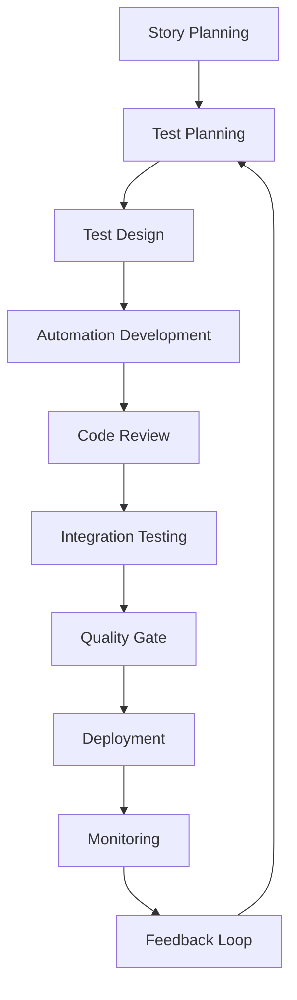

# QA Strategy: Building a High-Performance Testing Team

## Executive Summary

This document outlines a comprehensive QA strategy for evolving a team from manual testing to a modern, automated, and scalable quality assurance organization. The strategy focuses on building technical depth, establishing quality culture, and implementing sustainable processes that scale with business growth.

## Current State Assessment

### Team Maturity Level: Intermediate
- **Strengths**: Manual testing expertise, domain knowledge, process awareness
- **Gaps**: Automation skills, technical depth, CI/CD integration, monitoring
- **Opportunities**: Modern tooling adoption, cross-functional collaboration, quality culture

### Technology Stack Understanding
- **Frontend**: React, Remix, TypeScript, Tailwind CSS
- **Backend**: Fastify, GraphQL, Node.js, TypeScript
- **Infrastructure**: Monorepo, pnpm workspaces, Docker-ready
- **Testing**: Vitest, Playwright, Checkly monitoring

## Strategic Vision

### 6-Month Goals
1. **Technical Transformation**: 80% of team trained in automation tools
2. **Process Integration**: QA integrated into CI/CD pipeline
3. **Quality Culture**: Shift-left testing practices adopted
4. **Monitoring Foundation**: Production monitoring and alerting established

### 12-Month Goals
1. **Full Automation**: 90% of regression testing automated
2. **Performance Testing**: Load and performance testing capabilities
3. **Security Testing**: Security testing integrated into development workflow
4. **Data-Driven Quality**: Metrics-driven quality decisions

### 18-Month Goals
1. **Quality Engineering**: Team evolves to Quality Engineering role
2. **Cross-Functional Leadership**: QA leads quality initiatives across teams
3. **Innovation**: Advanced testing techniques (AI-assisted testing, chaos engineering)
4. **Industry Leadership**: Team recognized as quality engineering experts

## Team Evolution Roadmap

### Phase 1: Foundation Building (Months 1-3)

#### Technical Skills Development
```
Week 1-2: Tool Familiarization
├── Playwright basics and setup
├── Vitest configuration and usage
├── TypeScript fundamentals
└── Git and CI/CD concepts

Week 3-4: Automation Fundamentals
├── Page Object Model patterns
├── Test data management
├── Assertion strategies
└── Debugging techniques

Week 5-6: Advanced Automation
├── API testing with GraphQL
├── Test parallelization
├── Cross-browser testing
└── Performance testing basics

Week 7-8: Integration and Deployment
├── CI/CD pipeline integration
├── Test reporting and dashboards
├── Environment management
└── Monitoring setup

Week 9-12: Real Project Implementation
├── Convert manual tests to automated
├── Build comprehensive test suites
├── Establish quality gates
└── Document processes and best practices
```

#### Process Implementation
1. **Test Planning**: Risk-based test planning workshops
2. **Code Reviews**: QA participation in code review process
3. **Definition of Done**: Quality criteria integrated into DoD
4. **Bug Triage**: Structured bug classification and prioritization

### Phase 2: Capability Expansion (Months 4-9)

#### Advanced Testing Techniques
- **API Testing**: GraphQL contract testing, schema validation
- **Performance Testing**: Load testing, stress testing, capacity planning
- **Security Testing**: OWASP Top 10, penetration testing basics
- **Accessibility Testing**: WCAG compliance, screen reader testing
- **Visual Regression**: Screenshot comparison, visual diff detection

#### Tool Mastery
- **Playwright Advanced**: Custom matchers, fixtures, parallel execution
- **Vitest Advanced**: Mocking strategies, coverage analysis, custom reporters
- **Monitoring**: Checkly setup, alerting configuration, dashboard creation
- **CI/CD**: GitHub Actions, deployment pipelines, quality gates

#### Quality Engineering Practices
- **Test Architecture**: Scalable test framework design
- **Test Data Management**: Dynamic data generation, test isolation
- **Environment Strategy**: Test environment automation, data seeding
- **Metrics and Reporting**: Quality metrics, trend analysis, KPI tracking

### Phase 3: Strategic Leadership (Months 10-18)

#### Quality Culture Leadership
- **Cross-Functional Collaboration**: Lead quality initiatives across teams
- **Training Programs**: Develop training materials for other teams
- **Quality Advocacy**: Promote quality-first mindset throughout organization
- **Process Innovation**: Continuous improvement of testing processes

#### Advanced Capabilities
- **AI-Assisted Testing**: Leverage AI for test generation and maintenance
- **Chaos Engineering**: Implement fault injection and resilience testing
- **Observability**: Advanced monitoring, tracing, and debugging capabilities
- **Compliance**: Regulatory testing, audit preparation, compliance automation

## Skills Development Framework

### Technical Skills Matrix

| Skill Category | Beginner | Intermediate | Advanced | Expert |
|----------------|----------|--------------|----------|---------|
| **Manual Testing** | ✅ | ✅ | ✅ | ✅ |
| **Test Planning** | ✅ | ✅ | ✅ | ✅ |
| **Playwright** | 🎯 | 🎯 | 🎯 | 🎯 |
| **Vitest** | 🎯 | 🎯 | 🎯 | 🎯 |
| **TypeScript** | 🎯 | 🎯 | 🎯 | 🎯 |
| **GraphQL** | 🎯 | 🎯 | 🎯 | 🎯 |
| **CI/CD** | 🎯 | 🎯 | 🎯 | 🎯 |
| **Monitoring** | 🎯 | 🎯 | 🎯 | 🎯 |
| **Performance Testing** | 🎯 | 🎯 | 🎯 | 🎯 |
| **Security Testing** | 🎯 | 🎯 | 🎯 | 🎯 |

**Legend**: ✅ Current Level | 🎯 Target Level

### Learning Pathways

#### Pathway 1: Test Automation Engineer
```
Month 1-2: Core Automation Skills
├── Playwright fundamentals
├── Test framework design
├── Page Object Model
└── Basic CI/CD integration

Month 3-4: Advanced Automation
├── API testing mastery
├── Test data strategies
├── Parallel execution
└── Reporting and dashboards

Month 5-6: Specialization
├── Performance testing
├── Cross-browser testing
├── Mobile testing
└── Accessibility testing
```

#### Pathway 2: Quality Engineer
```
Month 1-3: Technical Foundation
├── TypeScript mastery
├── GraphQL expertise
├── System architecture understanding
└── DevOps practices

Month 4-6: Quality Engineering
├── Test strategy development
├── Quality metrics design
├── Process optimization
└── Tool evaluation and selection

Month 7-9: Leadership Skills
├── Team mentoring
├── Cross-functional collaboration
├── Quality culture building
└── Strategic planning
```

#### Pathway 3: Test Architect
```
Month 1-4: Deep Technical Skills
├── Advanced automation patterns
├── Test framework architecture
├── Performance optimization
└── Security testing expertise

Month 5-8: System Design
├── Scalable test architecture
├── Infrastructure design
├── Monitoring and observability
└── Compliance and governance

Month 9-12: Strategic Leadership
├── Quality strategy development
├── Tool and process innovation
├── Industry best practices
└── Team scaling strategies
```

## Quality Culture Transformation

### Shift-Left Testing Implementation

#### Developer-QA Collaboration
```
Planning Phase:
├── QA participation in story refinement
├── Risk assessment and test planning
├── Acceptance criteria validation
└── Testability review

Development Phase:
├── Pair testing with developers
├── Early feedback on testability
├── Automated test development
└── Continuous integration testing

Review Phase:
├── Code review participation
├── Test coverage analysis
├── Quality gate validation
└── Release readiness assessment
```

#### Quality Ownership Model
- **Developers**: Unit tests, integration tests, code quality
- **QA Engineers**: E2E tests, user journey validation, quality metrics
- **Product Owners**: Acceptance criteria, user story validation
- **DevOps**: Infrastructure testing, deployment validation, monitoring

### Quality Metrics and KPIs

#### Technical Metrics
- **Test Coverage**: 80%+ line coverage, 90%+ branch coverage
- **Test Execution Time**: < 5 minutes for unit tests, < 15 minutes for E2E
- **Test Stability**: < 5% flaky test rate
- **Defect Detection**: 90%+ of production issues caught by tests

#### Process Metrics
- **Lead Time**: Time from code commit to production deployment
- **Mean Time to Recovery**: Time to resolve production issues
- **Defect Escape Rate**: Percentage of defects found in production
- **Quality Gate Pass Rate**: Percentage of builds passing quality gates

#### Business Metrics
- **User Satisfaction**: Customer-reported quality issues
- **Performance**: Application response times and availability
- **Cost of Quality**: Testing effort vs. defect resolution cost
- **Innovation Velocity**: Feature delivery speed with quality

## Tool and Technology Strategy

### Core Testing Stack

#### Test Automation
- **E2E Testing**: Playwright (multi-browser, mobile support)
- **Unit/Integration**: Vitest (fast, TypeScript-native)
- **API Testing**: GraphQL-request + custom utilities
- **Visual Testing**: Playwright screenshot comparison
- **Performance Testing**: Playwright performance APIs + custom tools

#### Monitoring and Observability
- **Synthetic Monitoring**: Checkly (browser and API checks)
- **Real User Monitoring**: Integration with existing APM tools
- **Error Tracking**: Sentry or similar for production error monitoring
- **Performance Monitoring**: Web Vitals tracking and alerting

#### Development and Deployment
- **Version Control**: Git with feature branch workflow
- **CI/CD**: GitHub Actions with quality gates
- **Containerization**: Docker for consistent test environments
- **Infrastructure**: Cloud-based test environments (AWS/GCP/Azure)

### Tool Evaluation Criteria

#### Selection Criteria
1. **Technical Fit**: Compatibility with existing tech stack
2. **Learning Curve**: Time to productivity for team
3. **Scalability**: Ability to grow with team and application
4. **Community Support**: Documentation, community, and ecosystem
5. **Cost Effectiveness**: ROI considering licensing and maintenance

#### Evaluation Process
1. **Proof of Concept**: 2-week evaluation with real scenarios
2. **Team Feedback**: Developer and QA engineer input
3. **Performance Testing**: Load testing and stability evaluation
4. **Integration Assessment**: CI/CD and toolchain integration
5. **Decision Matrix**: Weighted scoring across all criteria

## Process and Workflow Design

### Test Development Workflow



### Quality Gates Implementation

#### Pre-commit Gates
- **Linting**: Code style and quality checks
- **Type Checking**: TypeScript compilation validation
- **Unit Tests**: Fast feedback on code changes
- **Security Scanning**: Basic vulnerability detection

#### Pull Request Gates
- **Test Coverage**: Minimum coverage requirements
- **Integration Tests**: API and component testing
- **Performance Tests**: Regression detection
- **Security Tests**: Comprehensive security scanning

#### Deployment Gates
- **E2E Tests**: Full user journey validation
- **Load Tests**: Performance under realistic load
- **Security Tests**: Production security validation
- **Monitoring Setup**: Health checks and alerting

### Bug Lifecycle Management

#### Classification System
- **Severity**: Critical, High, Medium, Low
- **Priority**: P1, P2, P3, P4
- **Type**: Functional, Performance, Security, Usability
- **Component**: Frontend, Backend, Infrastructure, Process

#### Workflow Stages
1. **Discovery**: Bug identification and initial assessment
2. **Triage**: Classification and assignment
3. **Investigation**: Root cause analysis and impact assessment
4. **Resolution**: Fix development and testing
5. **Verification**: Validation and regression testing
6. **Closure**: Documentation and prevention measures

## Training and Development Program

### Structured Learning Program

#### Month 1: Foundation
- **Week 1-2**: Tool Setup and Basic Usage
  - Playwright installation and configuration
  - Vitest setup and first tests
  - TypeScript basics and IDE setup
  - Git workflow and branching strategy

- **Week 3-4**: Test Design Principles
  - Test planning and strategy
  - Risk-based testing approaches
  - Test case design and documentation
  - Bug reporting and tracking

#### Month 2: Automation Fundamentals
- **Week 1-2**: Playwright Mastery
  - Advanced selectors and interactions
  - Page Object Model implementation
  - Test data management strategies
  - Debugging and troubleshooting

- **Week 3-4**: API Testing
  - GraphQL testing techniques
  - Authentication and session management
  - Error handling and validation
  - Performance testing basics

#### Month 3: Integration and Deployment
- **Week 1-2**: CI/CD Integration
  - GitHub Actions workflow setup
  - Quality gate implementation
  - Test reporting and dashboards
  - Environment management

- **Week 3-4**: Monitoring and Observability
  - Checkly setup and configuration
  - Alerting and notification setup
  - Performance monitoring
  - Production health checks

### Mentoring and Pairing Program

#### Pair Programming Sessions
- **Weekly Sessions**: 2-hour pairing sessions with senior developers
- **Rotating Partners**: Different team members each week
- **Focus Areas**: Code review, test development, debugging
- **Knowledge Sharing**: Cross-training on different areas

#### Mentoring Assignments
- **Senior QA → Junior QA**: Technical skill development
- **Developer → QA**: System architecture understanding
- **QA → Developer**: Testing best practices and quality mindset
- **External Mentors**: Industry experts for specialized topics

### Continuous Learning Culture

#### Learning Time Allocation
- **20% Time**: 1 day per week for learning and experimentation
- **Conference Attendance**: Annual conference budget per team member
- **Online Courses**: Subscription to learning platforms
- **Certification Support**: Financial and time support for relevant certifications

#### Knowledge Sharing
- **Weekly Tech Talks**: Team members present on new learnings
- **Documentation**: Comprehensive internal documentation
- **Best Practices**: Regular updates to testing standards
- **Lessons Learned**: Post-mortem documentation and sharing

## Success Metrics and KPIs

### Team Development Metrics

#### Skill Progression
- **Certification Completion**: Industry certifications achieved
- **Training Completion**: Structured training program completion
- **Tool Proficiency**: Self-assessed and peer-reviewed skill levels
- **Knowledge Sharing**: Number of tech talks and documentation contributions

#### Quality Impact
- **Defect Prevention**: Bugs caught earlier in development cycle
- **Test Coverage**: Automated test coverage improvements
- **Release Quality**: Production defect rates and user satisfaction
- **Process Efficiency**: Time savings through automation and process improvement

### Business Impact Metrics

#### Development Velocity
- **Feature Delivery Speed**: Time from concept to production
- **Release Frequency**: Number of releases per time period
- **Lead Time**: Time from code commit to production
- **Mean Time to Recovery**: Time to resolve production issues

#### Quality Metrics
- **Customer Satisfaction**: User-reported quality issues
- **System Reliability**: Uptime and performance metrics
- **Security Posture**: Security vulnerability detection and resolution
- **Compliance**: Regulatory and audit requirement compliance

## Risk Management and Mitigation

### Technical Risks

#### Skill Gap Risks
- **Risk**: Team struggles with new technologies
- **Mitigation**: Phased learning approach, external training, mentorship
- **Contingency**: Contract resources for critical skills

#### Tool Adoption Risks
- **Risk**: Tools don't meet expectations or team resistance
- **Mitigation**: Thorough evaluation, pilot programs, team involvement
- **Contingency**: Fallback options and tool flexibility

#### Process Change Risks
- **Risk**: Resistance to new processes and workflows
- **Mitigation**: Gradual implementation, team buy-in, clear benefits
- **Contingency**: Hybrid approaches and process flexibility

### Business Risks

#### Quality Regression
- **Risk**: Quality decreases during transition period
- **Mitigation**: Parallel manual and automated testing, gradual automation
- **Contingency**: Manual testing backup and rapid rollback capability

#### Delivery Delays
- **Risk**: Learning curve impacts delivery timelines
- **Mitigation**: Realistic timelines, parallel work streams, external support
- **Contingency**: Scope adjustment and timeline flexibility

## Implementation Timeline

### Phase 1: Foundation (Months 1-3)
- **Month 1**: Tool setup, basic training, initial automation
- **Month 2**: Advanced automation, API testing, team skill building
- **Month 3**: CI/CD integration, monitoring setup, process implementation

### Phase 2: Expansion (Months 4-9)
- **Months 4-6**: Performance testing, security testing, advanced techniques
- **Months 7-9**: Quality engineering practices, cross-functional collaboration

### Phase 3: Leadership (Months 10-18)
- **Months 10-12**: Strategic leadership, quality culture, innovation
- **Months 13-15**: Advanced capabilities, industry best practices
- **Months 16-18**: Team scaling, process optimization, continuous improvement

## Conclusion

This QA strategy provides a comprehensive roadmap for transforming a manual testing team into a modern, automated, and strategic quality engineering organization. The approach balances technical skill development with process improvement, ensuring both immediate impact and long-term sustainability.

Key success factors:
1. **Gradual Transformation**: Phased approach minimizes disruption
2. **Skill Development**: Comprehensive training and mentoring program
3. **Tool Integration**: Modern tooling with proven effectiveness
4. **Quality Culture**: Shift-left mindset and cross-functional collaboration
5. **Continuous Improvement**: Metrics-driven optimization and innovation

The strategy positions the team to not only maintain high quality standards but also drive quality improvements across the entire organization, ultimately contributing to better user experiences and business outcomes.

